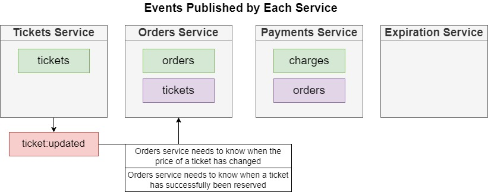
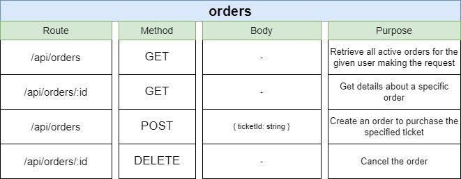

  <h3 align="center">E-Tickets Project</h3>
   

<!-- TABLE OF CONTENTS -->

  
Table of Contents

  <ol>
    <li>
      <a href="#about-the-project">About The Project</a>
      <ul>
        <li><a href="#services">Services</a></li>
        <li><a href="#Events-and-Architecture-Design">Events and Architecture Design</a></li>
        <li><a href="#common-package">common package</a></li>
        <li><a href="#auth-service">auth service</a></li>
        <li><a href="#tickets-service">tickets service</a></li>
        <li><a href="#orders-service">orders service</a></li>
        <li><a href="#payments-service">payments service</a></li>
        <li><a href="#expiration-service">expiration service</a></li>
        <li><a href="#built-with">Built With</a></li>
      </ul>
    </li>
    <li>
      <a href="#getting-started">Getting Started</a>
    </li>
  </ol>

<!-- ABOUT THE PROJECT -->
 
 

## About The Project

An E-Commerce app for selling and buying e-tickets using Microservices architecture with optimistic concurrency control. mainly focused on the back-end.

<h2 id="services">Services</h2>

 <h4>The app consists of 5 services</h4>

<table class="tg">
<thead>
  <tr>
    <th class="tg-7btt">Services</th>
    <th class="tg-7btt">Description</th>
  </tr>
</thead>
<tbody>
  <tr>
    <td class="tg-7btt">auth</td>
    <td class="tg-8bgf">Everything related to the user signup/signin/signout/</td>
  </tr>
  <tr>
    <td class="tg-7btt">tickets</td>
    <td class="tg-8bgf">Ticket creation/editing. knows whether a ticket can be updated</td>
  </tr>
  <tr>
    <td class="tg-7btt">orders</td>
    <td class="tg-8bgf">Order creation/editing</td>
  </tr>
  <tr>
    <td class="tg-7btt">expiration</td>
    <td class="tg-8bgf">watches for orders to be created  cancels them after 15 minutes</td>
  </tr>
  <tr>
    <td class="tg-7btt">payments</td>
    <td class="tg-8bgf">Handles credit card payments. Cancels orders if payments fails, completes if payment succeeds</td>
  </tr>
</tbody>
</table>

<h2 id="Events-and-Architecture-Design">Events and Architecture Design</h2>

<h2 id="common-package">common package</h2>

documentation related to the common package can be found here ()

<!-- auth service -->
<h2 id="auth-service">auth service</h2>
<h4 style="text-decoration:underline">End points</h4>

<!-- tickets service -->
<h2 id="tickets-service">tickets service</h2>
<h3 style="text-decoration:underline">End points</h3>

<h3 style="text-decoration:underline">Event flow</h3>

<h3 style="text-decoration:underline">Shared library</h3>

<!-- orders service  -->
<h2 id="orders-service">orders-service</h2>
<h4 style="text-decoration:underline">End points</h4>

<h3 style="text-decoration:underline">Event flow</h3>

<!-- payments service  -->
<h2 id="payments-service"></h2>
<h4 style="text-decoration:underline">Payment service flow</h4>

<h2 id="expiration-service">expiration service</h2>
<h4 style="text-decoration:underline">The Working of the expiration service</h4>

<h2 id="built-with">Built With</h2>

- [node.js](https://nodejs.org/)
- [typescript](https://www.typescriptlang.org/)
- [express.js](https://expressjs.com/)
- [express-validator](https://www.npmjs.com/package/express-validator)
- [next.js](https://nextjs.org/)
- [react.js](https://www.npmjs.com/package/react)
- [NATS Streaming Server](https://github.com/nats-io/nats-streaming-server)
- [jwt](https://www.npmjs.com/package/jsonwebtoken)
- [mongoose](https://www.npmjs.com/package/mongoose)
- [cookie-session](https://www.npmjs.com/package/cookie-session)
- [bull](https://www.npmjs.com/package/bull)
- [redis](https://www.npmjs.com/package/redis)
- [jest](https://www.npmjs.com/package/jest)
- [supertest](https://www.npmjs.com/package/supertest)
- [axios](https://www.npmjs.com/package/axios)
- [stripe](https://stripe.com/)
- [mongodb-memory-server](https://www.npmjs.com/package/mongodb-memory-server) -> used for testing
- [common](https://github.com/Ahmed-Mattar/common_E-tickets) -> an npm package made specifically for this project to host shared code between different services
- [Kubernetes](https://kubernetes.io/)
- [skaffold](https://skaffold.dev/)
- [docker](https://www.docker.com/)

## getting started

it's tested on google's kubernetes engine.

1- git clone this repo and run npm install on every service  
2- make sure you install skaffold  
3- make sure to set up a k8s cluster  
4- set up the env variabls on the cluster  
5- wire up skaffold to the cluster  
6- run skaffold dev

(<a href="#top">back to top</a>)

